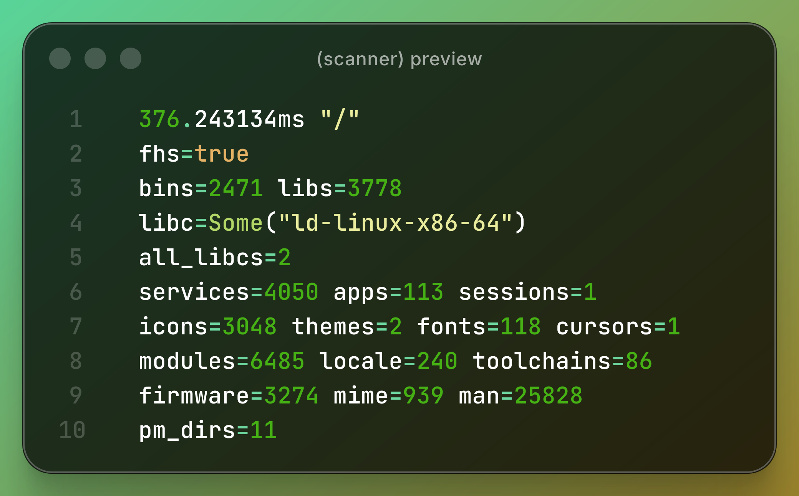

# scanner

scan module for nexus. single tree pass across a layer rootfs, produces
a flat profile of every artefact found: execs, libraries, services,
fonts, icons, themes, cursors, desktops, sessions, man pages, locale trees,
kernel modules, toolchains, firmware, mime types, and package manager dirs -
all relative to the layer root

## what it detects

- execs - ELF and scripts, PT_INTERP and shebang, static/dynamic
- libs - .so files, DT_SONAME and DT_NEEDED
- services - supervised dirs, executable scripts, text units (no name tables)
- desktop entries - app launchers
- wm - display-manager/wayland sessions
- icons - any file under theme/size/name in an icons tree
- cursors - cursor files inside a cursor theme dir
- fonts - any file under a fonts tree (extension is the format)
- themes - subdir names as engines, trailing versions stripped
- man pages - section from directory name, optional locale dir
- locale trees - language from the directory name
- kernel modules - .ko files under lib/modules
- toolchains - crt*.o and *.a artefacts with name/version pair
- firmware - blobs under lib/firmware
- mime - .xml files under usr/share/mime
- pm dirs - populated dirs under var/lib and var/db
- libc - loader identity and all unique loaders across the layer
- fhs - whether the rootfs follows the hierarchy standard

## license

GPL-2.0-only
